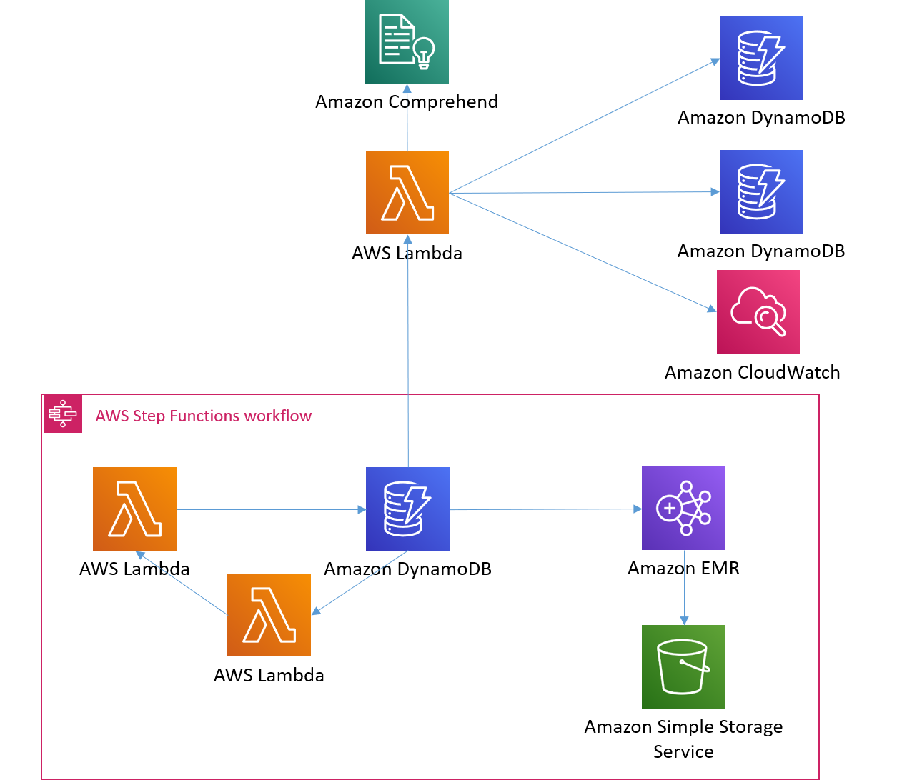

# Overview
This project is associated with a Medium post titled which explains the background on this application.

The purpose of this repo is to create a serverlesss tool in AWS which will collect tweets for a specified hashtag for a specified amount of time, and plot it in Cloudwatch. Currently the code is configured to track two sets of hashtags seperately. This could be used to compare the sentiment of two teams fanbases.


# Model Overview


The process is comprised of 3 areas:
* Stream and initial storage
* Dealing with sentiment
* Visualize the results

## Stream and initial storage
The first part of this code is the lambda to stream tweets. This lambda function is code that could be taken out of the lambda format and run locally. This lambda will track the specified hashtags and when a new tweet is found store it in DynamoDB. We can add attributes in the future and it won’t break our table (this functionality will be used when we add sentiment to our table).

There is another lambda that is used in this step that will track the number of times the tweet streaming lambda has executed. This lambda will pass information on the number of executions from one lambda call to the next.

## Dealing with sentiment
Once we have tweets populating the DynamoDB in real time we need to analyze the new information in real time. To do this we will create a lambda which will poll the DynamoDB table and check for new rows. We can use this lambda to analyze the sentiment of each new tweet and store this information back in the DynamoDB table.

To perform the sentiment analysis we will use an AWS tool called Comprehend. This service has an API you can call and get positive/negative/neutral scores returned. This will become useful for us to simplify our process. Instead of having to train our own model we can leverage this pretrained model.

## Visualize the results
One way we can visualize the data in real time is by using Cloudwatch metrics. Metrics allow us to publish a single value to Cloudwatch and visualize it on a plot. This is a somewhat simple application, but in our case very useful. To create the Cloudwatch plot we will publish the metric in our lambda that evaluates sentiment.

# Model Execution
To run the code you need to make sure you have Twitter API keys as well as the AWS and SAM CLI set up. Instructions for these can be found in the Medium article. You will also have to specify the length of time for the lambda to run as well as the hashtags you want to track.

Once you have all of the pieces installed you can execute the code. To execute you need to install the pakages locally by:
`pip install -r twit_stream/requirements.txt -t .`

You can then deploy the package to AWS:
```
sam build
sam package — template-file template.yaml — s3-bucket yourS3bucket — output-template-file packaged.yaml
sam deploy — template-file ./packaged.yaml — stack-name twitstream-stack — capabilities CAPABILITY_IAM
```


# Repo Structure
<pre>twitter_stream/  
 ┬  
 ├ README.md (explaination of the repo)
 ├ lambda_twitter_stream.py (TO BE DELETED) 
 ├ template.yaml (Cloudformation template file to create AWS resources and define execution process)
 ├ twitter_steamer.py (python file that is used to test outside of AWS, same as lambda_twitter_stream behavior) 
 ├ Overall_architecture.png (picture of the architecture of the project used in the README.md)
 └ [DIR] twit_stream
     ┬  
     ├ lambda_sentiment.py (python file used to create lambda to evaluate sentiment)
     ├ lambda_twitter_stream.py (python file used to create lambda to clean and stream tweets)
     └ requirements.txt (CSV file containing all of the data from the RECS)  
 
</pre>


# Envirnment
## Libraries
